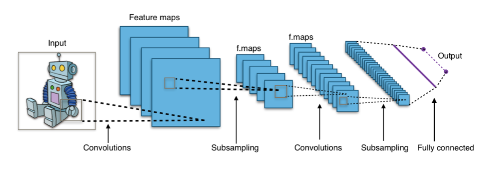
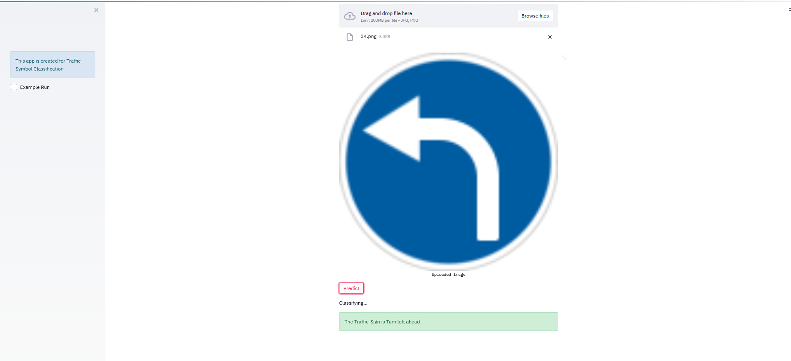

# Traffic Sign Detection App
 
[-- Traffic Sign Detection app](https://traffic-sign-detection-app.herokuapp.com/)

For working visit : https://www.kaggle.com/pg1007/traffic-model

**Convolutional Neural Network Model**
 CNN or ConvNet is a deep, feed-forward artificial neural network. It is a feed-forward neural networks are also called multi-layer perceptrons(MLPs), which are the quintessential deep learning models. The models are called "feed-forward" because information flows right through the model. There are no feedback connections in which outputs of the model are fed back into itself.

Flow-Chart of Methodology

Working of App

